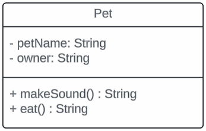
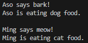

# Exercise 1: Single Responsibility Principle (SRP)

## Problem Scenario
The following object violates **Single Responsibility Principle (SRP)**. Make the adjustment in a form of java code to correct the violation.

## Notes
- `Pet.java` contains only pet attributes.
- `PetBehavior.java` defines an interface for behaviors.
- `DogBehavior.java` implements the pet behavior.
- `CatBehavior.java` implements the pet behavior.
- `Main.java` acts as the entry point.

## Output
