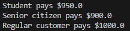

# Exercise 2: Open/Close Principle

## Problem Scenario
The following code violates the **Open/Close Principle**. Refactor the program to remove the violation.

```
public class Customer { 
 
  private String name; 
  private String type; // "Student", "Senior Citizen", or "Regular" 
 
  public Customer(String name, String type) { 
    this.name = name; 
    this.type = type; 
  } 
 
  public double calculateDiscount(double amount) { 
    if (type.equalsIgnoreCase("Student")) { 
      return amount * 0.05; 
    } else if (type.equalsIgnoreCase("Senior Citizen")) { 
      return amount * 0.10; 
    } else { 
      return 0.0; // No discount for Regular 
    } 
  } 
 
  public double applyDiscount(double amount) { 
    return amount - calculateDiscount(amount); 
  } 
}
```

## Notes
- `Customer.java` contains only customer attributes.
- `DiscountStrategy.java` defines an interface for discount strategies.
- `StudentDiscount.java` implements the discount strategy for students.
- `SeniorCitizenDiscount.java` implements the discount strategy for senior citizens.
- `RegularDiscount.java` implements the discount strategy for regular customers.
- `Main.java` acts as the entry point.

## Output
