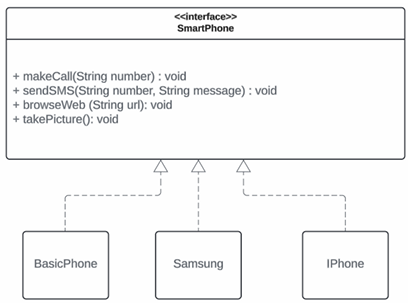
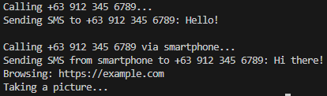

# Exercise 3: Interface Segregation Principle

## Problem Scenario
The following design has the following problem:
* The `SmartPhone` interface defines methods for making calls, sending SMS, browsing the web, and taking pictures.
* While smartphones (`Iphone` and `Samsung`) can utilize all functionalities, a basic phone (`BasicPhone`) only needs calling and SMS capabilities.
* Forcing the `BasicPhone` class to implement ununsed methods (`browseWeb` and `takePicture`) violates ISP.

Show your solution in codes how to remove the **Interface Segreration** problem.

## Notes
- `CallAndSMS.java` defines the ability to make calls and send SMS. Implemented by all phone types, both basic and smartphones.
- `WebBrowsing.java` defines the ability to browse the web. Implemented **only by smartphones**, since basic phones do not support web browsing.
- `Camera.java` defines the ability to take pictures. Implemented **only by smartphones**, since basic phones do not have a camera.
- `BasicPhone.java` represents a basic phone the **only supports calling and SMS**. Implements **only** `CallAndSMS`; does **not** implement web browsing or camera functionality.
- `Smartphone.java` represents a modern smartphone with **calling, SMS, web browsing, and camera** functionalities. Implements **all three interfaces (`CallAndSMS`, `WebBrowsing`, and `Camera`)** to support full functionality.

## Output
